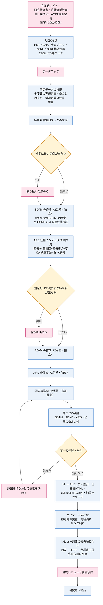

# 解析パイプライン計画

作成日：2026-07-21
改訂日：2026-08-22

データロック後に「固定データ → SDTM → ADaM → ARD → 図表 → 研究者への納品物」までを Claude 主導で回すための汎用フロー。必要な材料、人の介入点、内部検証の設計、成果物の形をまとめる。目的は、判断を要する要所を明確に切り出しつつ、機械的作業を一気通貫で実行できる状態を作ることにある。

本書は試験横断の枠組みのみを持つ。試験固有の値（統計解析計画書・研究計画書の所在、症例数、集団フラグの実体、エンドポイントの導出ロジック、図表ごとの操作的定義）は各試験リポジトリの `docs/` に置き、本書には写さない。参照関係は最後の「試験側に置く文書」に示す。

関連：ARS・ARD の調査は [cdisc-ars.md](cdisc-ars.md)、SDTM の適合性検証は [sdtm-conformance-validation.md](sdtm-conformance-validation.md)、電子症例報告書の設計レビューは [../review/ecrf-review/](../review/ecrf-review/README.md)、試験立案時のレビューは [../review/planning-review/](../review/planning-review/README.md)、解析の段階で見つかった欠陥の型は [../findings/analysis-findings-log.md](../findings/analysis-findings-log.md)。

## 解析と納品の方針

解析は SAS と R の二重コーディングで行う。SAS は実務の主軸、R は研究者への納品と拡張性を担う。両系統とも本解析であり、どちらか一方の検算にとどまるものではない。2系統の結果は ARS ベースで突き合わせて整合を確認する。

納品は R と図表に限る。引き渡し相手が研究者で SAS を持たない場合、R で納品すれば受領後に追加解析を自ら回せる。SAS プログラム・二重コーディングの事実・突合の結果は納品物に含めない（内部に留める）。二重コーディングや突合を外に出すと、かえって不一致の解釈を巡る議論を生みかねないため、体制が確実になるまでは外に出さない。

突合の粒度は、レイアウト済みの図表ではなく ARD（Analysis Results Dataset）のレベルでそろえる。図表は書式・結合順・セル位置の差に埋もれて機械照合しにくいが、ARD は結果値の縦持ちなので結果データフレーム同士を直接突合できる。ただし図表の層でも、描画時にセル単位の台帳を両系統で書き出せば突合できる。

## データの層

受領データから納品物までを6層で扱う。層の境界でプログラムを分け、層ごとに独立実行と検証ができるようにする。

- 受領データ — データセンターから受け取る CSV 等。SDTM のドメイン名・変数名を使うが、相対日・EPOCH・標準化結果・DM の派生変数などは出力されないことが多い（詳細は [ptosh-sdtm-preparation.md](ptosh-sdtm-preparation.md)「1. 受領データの性質」）
- SDTM — CDISC SDTM 準拠へ正規化した層。相対日・EPOCH・標準化結果・DM の派生変数をここで埋め、以降の層は再計算しない。適合性検証はこの層で行う
- ADaM — 解析用データセット群（ADSL・ADTTE・ADRS・ADAE 等）。解析対象集団の判定、治療相の割り付け、イベント日の導出といった試験固有の解釈はこの層で行う
- ARD — 解析結果の縦持ちデータ。1行が1つの結果値。レイアウトを持たない
- 図表 — 番号付きの表・図。ARD から描画する
- 納品物 — 研究者へ渡すパッケージ。R のプログラム、図表、Dataset-JSON、仕様書、トレーサビリティ索引

受領データが SDTM のドメイン名・変数名を使っていても、派生変数を欠くなら SDTM 層を省いて ADaM を作らない。派生の起点が複数箇所に散ると、同じ計算が層をまたいで重複し、いずれずれる。

## フォルダ構成と命名規則

受領物・生成データ・人が読むものを3つに分ける。階層は3段までとし、名前だけで中身が分かるようにする。

```
input/                受領したもの。解析は書き込まない
  rawdata/            受領データ（CSV 等）
  acrf/               注釈付き症例報告書
  ext/                外部データ（手作業で作る一次データ）
  spec/               単独フォルダへ展開する配布形態で使う宣言の写し

datasets/             解析が作るデータセット。実装系統ごとに分ける
  sas/  sdtm/ adam/ ard/
  r/    sdtm/ adam/ ard/

output/               人が読むもの・渡すもの
  tlf/
    sas-ja/ sas-en/   SAS 系の図表
    r-ja/   r-en/     R 系の図表
  compare/            突合の結果とセル台帳
  qc/                 品質検査プログラムの出力
  spec/               仕様書の HTML
  deliver/
    r/                トレーサビリティ索引と納品パッケージ（R 系）
    sas/              SAS 系で同じ一式を作る場合の置き場

log/                  実行ログ
```

規則は3つである。

第一に、受領物と生成物を `input` と `datasets` で分ける。SDTM と ADaM は解析が作ったものであり、SAS から見て「解析の入力」であっても受領物ではない。`datasets` という名前は eCTD の `m5/datasets/<study>/tabulations` と `.../analysis` の慣行に合わせた。

第二に、実装系統の区別はディレクトリで行い、ファイル名の接尾辞（`_r` 等）に頼らない。接尾辞は目立たず、層によって分け方が変わると（ある層はディレクトリ、別の層はファイル名）どちらの規則だったか思い出す手間が生まれる。`output/tlf` も同じ考えで「系統 → 言語」の順に並べる。

第三に、`output` には人が読むものと渡すものだけを置く。突合の結果とセル台帳は `compare`、品質検査プログラムの出力は `qc`、配布パッケージは `deliver` へ分ける。中間データは `datasets` にあるので `output` へ混ぜない。

## 図表の出力形式

配布の正は HTML とする。ブラウザだけで開けて追加ソフトが要らず、トレーサビリティ索引から個々の図表へリンクでき、日本語版と英語版を相互に行き来できる。図表ごとに1ファイルとするのは索引がリンクするためで、これは変えられない。

あわせて Excel（xlsx）を出す。研究者が数値をそのまま扱え、論文の図を自分で調整できるためである。言語ごとに1ブックとし、図表をシートに分ける。生存時間曲線は R 系ではブック内のデータ範囲を参照する Excel のチャートとして作る（`{openxlsx2}` と `{mschart}`）。SAS 系は `ODS EXCEL` で表を書き、図は画像として貼り込む。両系統で見た目は揃わないが、SAS 系の Excel は証跡であって配布物ではないので支障はない。

RTF は作らない。以前は配布用に出していたが、HTML と Excel があれば足りる。文書へ組み込む体裁が要る場面では Excel から貼るか、その時点で HTML から変換する。毎回の実行で言語ごとに数 MB が溜まる割に、使う場面が限られていた。

突合は図表そのものではなくセル台帳（1行が1セルの CSV）で行う。HTML と Excel は人が読む配布物であり、比較の対象にしない。

## 全体フロー



桃色が人の介入、黄色が条件付きの停止、青が自動で流れる箇所である。CORE は CDISC Open Rules Engine（cdisc-rules-engine）の略で、SDTM の適合性検証エンジン。導入・実行の詳細は [sdtm-conformance-validation.md](sdtm-conformance-validation.md)。

ARS 仕様を ADaM 作成より前に置くのは、どの統計量をどの群で出すかが決まって初めて、ADaM が持つべき派生変数（治療相、サブグループフラグ、分母フラグ、パラメータの水準）が漏れなく決まるためである。ADaM を先に作ると、図表を書く段になって変数の不足が判明し、手戻りが ADaM・ARD・図表の全層に及ぶ。

固定データの検証をロック直後に置くのは、受領データ由来の不整合をデータセンターへ照会する時間を確保するため。照会の往復は数週間かかることがあり、解析の終盤で見つけると間に合わない。

立案時レビューを図の起点に置いたのは、条件付きの停止のほとんどが計画書と図表案の粒度に由来するためである。解析の段階では計画書は固定済みで、直すには改訂手続きが要る。ここを潰すのが介入を減らす唯一の道になる。

## 人の介入ポイント

必須2点と条件付き3点に絞る。必須以外は自動で進み、条件が発生したときだけ止まる。

必須（必ず止まる）。

1. データロックの実施。ロックはデータマネージャと統計責任者の権限行為である。パイプラインの起点
2. 最終レビューと納品承認。図表だけでなくコード・仕様書を含めた成果物一式が、数値だけでなく臨床的・統計的に妥当な表現かの確認と、研究者へ出す責任判断

条件付き（該当時のみ止まる）。

3. 規定に無い症例の取り扱い。集団フラグの確定で、規程の文言だけでは決まらない境界例が出たときに限る
4. 規定だけで決まらない解釈。統計解析計画書が固定済みであれば ARS 仕様は原則その機械的な書き起こしであり、未確定の解釈が新たに出た時だけ、その点に限って確認する
5. 突合の不一致のアジュディケーション。2系統または検算値が食い違った時のみ、原因を切り分けて両案を提示し、最終採否を人が判断する

3 と 4 は立案時レビューで減らせる。減った回数を測るのが枠組みの通過記録である（[../review/planning-review/README.md](../review/planning-review/README.md)）。

3 と 4 で確定した解釈は、判断そのものと根拠と影響範囲を試験側の文書に残す。研究計画書の条文が一意でない箇所（同じ項が別々の水準を前提にした2つの規定を含む、など）では、条文とコードを字面で突き合わせただけの後続レビューが「実装が規定と違う」と指摘してくる。記録が無いと同じ検討を最初からやり直すことになる。残すのは、照会の内容、研究代表医師の回答、統計解析計画書のどこへ反映したか、該当症例と数値への影響、そして解釈を反映した変数の定義である。狭義と広義のように同じ概念に2つの意味が生じたときは、フラグを分けて両方を持ち、変数ラベルと define.xml の derivation でどちらかが読めるようにする。

この種の解釈は試験ごとに違う。効果判定の水準の呼び名も、どの水準を寛解に含めるかも、試験の作られた時期と骨格にした先行試験によって変わる。ある試験で確定した解釈を別の試験へ持ち込まない。枠組みが定めるのは「条文が一意でなければ止めて照会し、確定したら記録する」という手続きだけである。

## 最終レビューの準備

必須2の「最終レビューと納品承認」に入る前に、レビュー対象を優先順位付けして提示する段階（フローチャートの S8）を置く。生成されるファイル（コード・図表・仕様書・Dataset-JSON 等）は数百に及ぶため、統計解析責任者が全件を同じ深さで見ることは非現実的である。優先順位付けが無いと、レビューの深さが見た順番に依存してしまう。

パッケージの検査（S7）が通った時点で、人手を介さず自動的に、統計解析責任者が目視で確認すべき書類の優先順位リストを生成し、レビュー着手時に提示する。対象は md だけでなく、図表・ソースコードを含む全ファイルである。優先順位の基準は次を目安にする。

- 主要評価項目・安全性の主要な結論に直結する図表と、その導出コード
- 二重コーディングの突合で不一致が出た箇所、または僅差で一致した箇所
- 立案時レビューで指摘があった箇所、および解析中に未決事項として残った判断
- `data-handling-decisions.md` に記録した、規定だけでは定まらない取り扱いの決定
- 疾患固有・試験固有の複雑なロジック（既存の実装パターンからの流用ではない箇所）
- それ以外（機械検査で0件が確認済みの定型的な背景表など）は優先度を下げてよい

この段階はまだ1試験でしか実施していないため、機械検査や規則には昇格させず、基準だけを残す。2試験目で同じ優先順位付けを行ったら、機械的に判定できる部分（突合の不一致件数、指摘の有無等を自動で集計して優先順位の根拠に使う）を抽出できるか見る（[../findings/README.md](../findings/README.md)「昇格の判定」）。

## 設計の原則

層の分け方に加えて、実装で守る原則が4つある。いずれも実際の試験で実装し、効果を確認したもの。

### 図表を宣言で駆動する

図表を「表ごとに1本のプログラム」で書かない。表示の作法（列幅・見出し・脚注・セル台帳への記録）を表示型のマクロ・関数に閉じ、個々の図表は CSV の1行で表す。この行が持つのは3つだけである。どの表示型で描くか、どの解析の結果値（ARD の `analysis_id`）を使うか、どの並び（群・水準）で出すか。この行を「宣言」と呼ぶ。列の完全な定義は [../templates/README.md](../templates/README.md)「tlf-index.csv」を参照。

宣言の正本は CSV 1つにし、SAS の描画・R の描画・トレーサビリティ索引の生成が同じ CSV を読む。宣言の実体を2つ持つと、照合という作業と、それを行うスクリプトが必要になる。照合は手動になりやすく、壊れても気づかない。試験A では、プログラムのマクロ呼び出しと CSV の両方に宣言を持たせていた時期があり、両者を突き合わせる照合スクリプトが符号化の移行で動かなくなっていたことに、しばらく気づかなかった。宣言の実体を CSV 1つにし、照合という作業ごと無くしてこの構図自体を解消した。

宣言をプログラムのソースから正規表現で拾う設計も同じ理由で採らない。マクロ呼び出しの書き方に暗黙の制約を課すことになり、制約を外れた宣言は静かに拾われず、その図表だけが検査の対象から外れる（試験A では実際に2図表が該当した）。検査の都合に正本の設計を合わせると、意味の違う2つの値を1つの列に相乗りさせるような歪みも生まれる。宣言を最初から CSV に持たせれば、ソースを解析する手段そのものが要らない。

表示型マクロの引数名は CSV の列名と同じにする。駆動ループが「列名=値」を機械的に連結するだけで済み、引数名と列名の対応表を持たずにすむ。対応表があれば、表示型を足すたびに2箇所を直す作業が生まれ、忘れれば黙って引数が落ちる。

CSV に実装の詳細（データセット名、解決前のマクロ変数）を入れない。入れると片方の系統だけが読める列になり、もう一方が特別扱いを持つ。

### 表示文言をカタログに集める

表題・副題・脚注・水準の表示名を、日本語と英語の対で1つの CSV に持つ。プログラムに文言を書かない。

水準の並びは順序番号で持ち、表示名の照合順序に任せない。照合順序に任せると文字符号化に依存し、セッションの符号化を変えるだけで並びが変わる。値は1つも変わらないので、系統間の突合でも前後比較でも検出できない。

このカタログは R 一式（`renv` で環境を固定したもの）と一緒に納品物に含める。研究者が納品後に表題・水準の表示名を変更したい場合、このカタログを編集して図表を再描画すれば済み、統計解析側への修正依頼を要しない。

### 図表の並び順を来院計画から決める

図表の行と列の並びは、試験の来院計画（SDTM の TV ドメイン）の `VISITNUM` 昇順を原則とする。すべての図表にこれを適用する。

治療の実施順を持っているのは `VISITNUM` だけである。水準の識別子を文字順に並べると実際の順序と食い違うことがある。2系列の地固め療法を交互に進める試験では、識別子の文字順（C1-1・C1-2・C1-3・C2-1…）と実際の順（C1-1・C2-1・C1-2・C2-2…）が違う。表示名で並べると、和文の照合順序が文字符号化によって変わるため、セッションの符号化を替えただけで並びが動く。件数の降順で並べる表示型では、時系列の水準が件数の多寡で入れ替わる。いずれも値は正しいまま並びだけが狂うので、突合では捕まらない。

`TV` に対応しない水準は3種類あり、扱いを決めておく。集計のために複数の来院をまとめた区分は、まとめた範囲の先頭の `VISITNUM` を使う。治療相ではない状態（コースの合間、全治療終了後、未到達など）は末尾に置く。来院と無関係な区分（到達までの時間の区分、検査値の分類など）は、図表の宣言（`tlf-index.csv`）で並びを指定する。

統計解析計画書の図表案がこの順序と異なる並びを示している場合は、計画書側をこの原則に合わせられないか統計家へ確認する。図表案は紙面での見え方を先に決めたものであることが多く、来院計画と突き合わせると順序の根拠が無いことがある。合わせられない理由（臨床的な読みの都合など）があるなら、その理由を記録したうえで例外とする。例外を作るときも、並びは図表の宣言が持ち、表示名や識別子の偶然の順序に頼らない。

識別子から `VISITNUM` への対応は `label-catalog.csv` に `visitnum` 列を設けて持つ。治療相のための専用のマスターファイルは作らない。識別子を引く先が2つに分かれると、同じ事実を2箇所で管理することになり、片方だけを直したときに表示名と並びが食い違う。`label-catalog.csv` は表示文言の辞書であると同時に、水準の並び順（`order`）と来院への対応（`visitnum`）を持つ。表示以外の属性を辞書へ入れるのは、識別子から引くものを1箇所に集めるためである。

治療相の識別子は1つの治療相に1つだけ与える。同義の識別子を並存させない。同じ相に2つの名前があると、`visitnum` を片方にだけ入れたときに一方の表は並びが直り、もう一方は元のまま残る。値は変わらないので突合では捕まらない。識別子の正本は ADaM の `APHASE` とし、ARD や図表の段階で新しい名前を作らない。

治療相の識別子は SDTM の `EPOCH`、ADaM の `APHASE`、ARD の群ラベル、図表の行ラベルの4層を貫く。後から変えると4層すべてを作り直し、突合をやり直すことになる。したがって識別子と `VISITNUM` の対応は SDTM の設計を固める段階で決め、以降の層はそれを参照するだけにする。

### 仕様書を相対パスで指す

プログラムのコメントが仕様書の節を相対パスで指す形にし、同梱するものはコメントから機械的に集める。R を回す起点の直下に `docs/` を置けば、リポジトリと配布物で同じ相対パスが解決する。参照先の実在は検査で毎回確かめる。

### セルの単位まで追える形にする

図表のセル1つから、解析ID・ADaM の変数・SDTM の変数・症例報告書の入力欄・注釈付き CRF まで辿れる HTML を作る。描画の際にセル台帳を書き出しておけば、トレーサビリティ索引の入力になると同時に、図表の層の突合にも使える。

## 必要な材料

ADaM の作成に着手する前に、以下がそろっている必要がある。ARS 仕様は統計解析計画書の固定版があれば先行できる。

### 一次入力データ

- 固定済みの受領データ一式。ロック版であることを明示的に確認する（納品日・レコード数・症例数）
- 受領 define.xml（SDTM 側、変数メタデータ）。値域・コードリストの確認に使う。SDTM の作成後、derived 変数を反映して define.xml(SDTM) として更新する。ADaM 側の define.xml はこの時点では存在せず、ADaM 作成後に変数マップ（`docs/variable-map.csv`）と Dataset-JSON から新規生成する（別の作り方であることに注意）
- 解析対象集団フラグ。全図表の分母を規定するため、ロック直後に最優先で確定する。判定根拠は試験側の文書に残す
- 外部データ。症例報告書に記録欄が無い事項を補うもの。仕様書を書いてから作る
- 受領データに存在しないドメインの要否確定。取得漏れか、そもそも存在しないのかをデータセンターに確認する

### 解析仕様

- 統計解析計画書の固定版。特に図表案の章が各図表のシェル（行・列・母集団・脚注）を規定する
- ARS 仕様インデックス。図表のシェルではなくこのレベルの仕様が ARD 生成の作業単位になる
- エンドポイント仕様書（中核エンドポイントの導出ロジック）
- 予測検算ファイル（症例単位の期待値）。突合の正解値になる。ロック版に対して更新する
- 電子症例報告書の構造定義（機械可読）と注釈付き CRF。症例報告書の項目と SDTM 変数の対応の正本になる
- 図表の宣言、表示文言のカタログ、評価時点の対応表。いずれも機械可読な CSV

### 実行環境

- SAS。入力・処理・出力をすべて UTF-8 にする。日本語版の既定 config は shift-jis なので、起動時に Unicode サーバーの config を指す。起動の作法と符号化の切り替えは組織内の SAS 環境ドキュメント「セッションの文字符号化」が持つ。既存試験の移行は [`sas-utf8-migration`](../skills/sas-utf8-migration/SKILL.md) スキル
- R 環境。`{survival}`（生存解析）、`{haven}`（SAS データセットの読み取り）、`{jsonlite}`（Dataset-JSON）、`{readr}`／`{dplyr}`／`{tibble}`（データ操作）、`{waldo}`（突合）、`{openxlsx2}`／`{mschart}`（Excel 出力とチャート）。バージョンを `renv` で固定し、研究者が受領後に同じ環境で再実行・拡張できるようにする。Windows では版に対応するバイナリが CRAN に無いパッケージがソースからのビルドになるため Rtools が要る
- CDISC CORE（SDTM の適合性検証。[sdtm-conformance-validation.md](sdtm-conformance-validation.md)）
- Python。トレーサビリティ索引・仕様書 HTML・納品パッケージの生成と、各種の検査。標準ライブラリだけで動かし、外部パッケージを足さない（理由と、受領資料の xlsx をどう読むかは [scripts/](README.md#scripts)）
- パスの自動解決。コードとデータを別ツリーに置き、実行時に両方を解決する

## 実行の順序

段階の順序は実行スクリプトを正本にする。文書へ写さない。写すと、順序を変えたときに2箇所を直す作業が生まれ、忘れれば文書だけが古くなる。

スクリプトは4本に分ける。受領データから図表までの本流、ADaM の Dataset-JSON の後処理、SDTM の変数メタデータ書き出し・define.xml(SDTM) の更新・Dataset-JSON 生成・適合性検証、ADaM の define.xml(ADaM) の生成。最後の1本は変数マップと Dataset-JSON から新規生成する別の作りで、本流の12段階には含めず独立に実行する。本流の中には依存のある並びがあるので（ARD の後にセル台帳、ADaM の後に JSON）、任意に並べ替えられる形にしない。

## スクリプトの汎用化

生成と検査のスクリプトは、試験名をコードに書かない。試験固有の値は設定1つに集め、スクリプトはそこから引く。設定の形と列の定義は [../templates/README.md](../templates/README.md) が持つ。

試験A の解析スクリプト11本を調べたところ、試験固有だったのは2つの値だけだった。試験の識別子（プログラム名の接頭辞・納品パッケージ名・表題に使う）と、データの置き場（Box のルートからの相対パス）である。5本は元から試験に依存しておらず、残る6本も参照していたのはこの2つだけだった。

- 依存なし — 仕様書 HTML の生成、症例報告書の項目と SDTM の対応の生成と検査、変数の一覧の検査、トレーサビリティ索引の検査
- 識別子だけ — トレーサビリティ索引の生成、図表の宣言の検査、納品パッケージの生成と検査
- 置き場だけ — パス解決（Python・PowerShell の2本）

設定を差し替えれば同じスクリプトが別の試験で動く。汎用化のたびに、改変の前後で成果物が1バイトも変わらないことを機械で確かめる。

生成物どうしに依存があるので、生成の順序を決めておく。トレーサビリティ索引は仕様書 HTML を読むため、仕様書を先に作る。順序を決めずに回すと、1回目と2回目で結果が変わり、差分を見た人が原因を追うことになる。

## 内部検証

SAS と R はいずれも本解析だが、両者を突き合わせる作業自体は納品物ではなく内部検証である。同一の固定データ・同一の ARS 仕様から、互いに参照せず独立実装し、層ごとに突合する。

### 独立性の担保

2系統は、互いのコードを見ずに同じ仕様（ARS 仕様・エンドポイント仕様）だけを入力にする。共有するのは仕様と固定データのみ。二重コーディングの独立性が突合の検出力を担保する。

R 系の各層は前の層の R 系の出力を入力にし、SAS の出力に依存しない形にする。片方の出力を経由すると、その時点で独立性が消える。

### 突合の単位

1. SDTM — 両系統のデータセットをキー結合し、変数の値を突き合わせる
2. ADaM — `ADSL`・`ADTTE`・`ADRS` などをキー結合し、解析値・フラグ・イベント日を数値許容差で突合
3. ARD — 各解析の結果値を、解析ID・統計量名・群のキーでそろえて突合。これが検証の主軸
4. 図表のセル台帳 — 描画時に書き出したセル単位の記録を、言語ごとに突合
5. 予測検算値との突合 — 主要エンドポイントは手計算値とも突合する。ARD・予測値・両系統の三者一致で確度が最も高い

### 突合で捕まるもの

捕まるのは計算違いより受け渡しの欠陥である。0例の水準の脱落、書き出し時の桁切れ、並べ替えキーが効かず識別子がずれる。いずれも片系統の出力を見ているだけでは気づけない。

仕様書の網羅性の欠落も出る。同じ仕様書から独立に2実装すると、割れる箇所は仕様書が規定していない箇所とほぼ一致する。割れの多さは、その層に仕様書が要ることの証拠になる。

### 出力

突合の結果は内部用の記録に残す。解析ごとに一致・不一致（該当キー・両系統の値・予測値・差分）を一覧化する。差分ゼロなら記録して先へ進み、差分ありのときだけ原因分類（丸め・母集団定義差・欠測扱い・ロジック差）を付けて提示する。被験者値を含むため git に置かず、研究者にも出さない。

## 着手前チェック

各段階に着手する前に、次をプリフライト・ゲートとして全項目チェックする。1項目でも欠けていれば着手しない。これは推奨ではなく必須の停止条件とする。

- 対象の段階と作業単位・系統
- 入力の所在と版（固定データのパス・納品日・症例数、参照する仕様のファイルとバージョン、集団フラグの版）
- 母集団と分母の定義（解析対象集団、サブグループの識別条件）
- エンドポイント解釈の参照先（どの規定に従うか、起算日・同時点の扱い・階層判定の明示）
- 治療相の識別子と `VISITNUM` の対応（1つの相に1つの識別子、正本は ADaM の `APHASE`、対応は `label-catalog.csv` の `visitnum` 列。SDTM の設計を固める段階で確定していること）
- 出力仕様（解析名・変数・統計手法・群、図表番号・表題・レイアウト・出力形式・保存先）
- 検証の基準（突合相手と許容差、記録の出力先）
- 禁止・制約事項（生データ・出力・ログ・ARD・突合結果を git に置かないこと、被験者データの中身をチャットに出さないこと、突合を外部に出さないこと）
- 独立性の指示（二重実装時は「相手系統のコードを参照せず、仕様と固定データのみから実装せよ」）
- 完了条件と次アクション

欠けている項目があれば先に進めず、欠落項目を箇条書きで明示して充足を待つ。欠落を推測・既定値・前回値で埋めて進めることは禁止する。誤った前提が全下流に伝播するため。

## リスクと落とし穴

- データロック未確定のまま着手しない。ロック前データで作った図表は作り直しになる
- 集団フラグが未確定のまま先へ進まない。母集団が決まらないと全図表の分母が動く
- 図表案はシェルであって仕様ではない。行項目が列挙されているだけで統計量・分母・群が指定されていない箇所が必ず残る。ARS 仕様で操作的定義まで落とし、決まらないものは未決事項として明示する
- 研究計画書の条文と実装ロジックを逐語で突合する。統計解析計画書が要約した時点で条件が落ちていることがある
- 疾患別ロジックの誤流用をしない。過去試験のプログラムを流用するときは、効果判定の階層・イベント定義が同じかを条文レベルで確認する
- 打ち切りフラグの向きを確認する。CDISC ADaM は 0 がイベント・1 が打ち切りだが、試験によって逆向きで書かれていることがある。取り違えてもエラーは出ず、反転した曲線だけが出る
- 見かけ上の一致に注意する。母集団や欠測扱いが両系統で同じ間違い方をすると一致してしまう。独立実装の徹底と、予測検算値との三者突合で担保する
- 符号化を層ごとに変えない。1つでも別の符号化のファイルが混ざると、読み込みで列がずれ、文字なら黙って別の値が入る
- 並び順の差は値の差として現れない。並びを表示名に依存させないことで構造的に避ける
- R の再現性を `renv` で固定する。固定しないと研究者の手元で動かず、追加解析できるという納品の狙いが崩れる
- 検証の入出力は各層の `QC/` で受ける。本流の出力と混ぜない
- スケジュールを審査会・報告の締切から逆算する

## 成果物一覧

納品物（研究者へ）。

- R 解析スクリプト一式（`renv` のロックファイル同梱）と、図表の宣言・表示文言のカタログ・変数の一覧などの機械可読な仕様 CSV。研究者が表示文言を変更して再描画できる
- 番号付きの図表（HTML。図表ごとに1ファイル）と Excel（言語ごとに1ブック）
- 各解析の ARD（研究者が別表示・追加解析に再利用できる結果データ）
- Dataset-JSON（SDTM・ADaM）、define.xml(SDTM)（受領 define.xml を derived 変数の反映で更新）、define.xml(ADaM)（変数マップと Dataset-JSON から新規生成）
- 作成仕様の HTML（節ごとに錨を持つ）
- トレーサビリティ索引の HTML（図表のセルから症例報告書まで辿れる）

内部成果物（保管・非納品）。

- SDTM・両系統の ADaM、SAS の解析プログラム一式
- 突合の記録
- ARS 仕様インデックス、予測検算ファイル、反省録

## 試験側に置く文書

各試験リポジトリの `docs/` に置き、本書からは参照のみとする。ファイル名は試験をまたいで揃える。

- `sdtm-spec.md` — 受領データから SDTM への変数対応（ドメイン別）
- `adam-spec.md` — ADaM の変数レベルの規則
- `analysis-population-derivation.md` — 解析対象集団フラグの判定根拠
- `ars-spec-index.md` — ARS 解析仕様インデックス
- `ard-double-coding-spec.md` — 2系統の突合の手順と許容差
- `r-pipeline-spec.md` — R 系のパイプラインと層ごとの突合の状態
- `tlf-declaration-design.md` — 図表の宣言の設計
- `label-and-traceability-design.md` — 表示文言とトレーサビリティ索引の設計
- `data-handling-decisions.md` — 規定だけでは定まらない取り扱いの決定記録
- `sdtm-conformance-findings-<日付>.md` — 適合性検証の指摘と対応
- `planning-review-<日付>.md` — 立案時レビューの結果
- `<外部データ>-external-data-spec.md` — 外部データの受領仕様

機械可読な正本も試験側に置く。図表の宣言、表示文言のカタログ、変数の一覧、評価時点の対応表。

## 適用例

試験A（第II相、90例登録）。2026-08 に本フローを一通り通した。

- 層：受領 CSV 18件 から SDTM・ADaM・ARD・図表・納品パッケージまで
- 実行：本流12段階を1本のスクリプトで回す。ADaM の Dataset-JSON 後処理、SDTM の define.xml 更新・適合性検証、ADaM の define.xml 生成はそれぞれ別のスクリプト
- 図表：90の宣言（表86・図4）を12種類の表示型で描く。宣言の正本は CSV 1つで、SAS・R・トレーサビリティ索引が読む
- 解析：1419件。セル台帳13872セル
- 突合：ARD は全行一致。図表は日英・両系統の4通りで86図表・不一致0・行数の差0
- 納品：441ファイル。同梱の検査でエラー0・警告0。トレーサビリティ索引は図表90件すべてを解決
- 符号化：2026-08-21 に SAS を UTF-8 セッションへ移し、全層を UTF-8 に統一した

止まった点は各試験の記録に残す。集めた一覧は次の試験のフローの分岐を減らすために使う。
